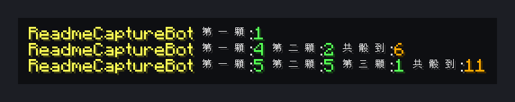

# 自動化骰子

[English](README.md) | **繁體中文**

擲一到三顆六面骰，結果會顯示給同一個世界的所有玩家。

> 本儲存庫包含同一個腳本的兩個版本：**繁體中文（zh-TW）** 是作者伺服器實際使用的原始版本；**English** 為完整英文翻譯版（指令、訊息與變數名稱皆為英文），功能相同。

<!-- BEGIN LIVE SCREENSHOTS -->

## 畫面預覽

*依序擲出一顆、二顆、三顆骰子。畫面上是伺服器實際廣播到該玩家世界的隨機結果。*

> 這些是實機擷取後重繪的畫面，不是原生客戶端截圖。流程為：無頭客戶端登入實機 Paper 26.2 伺服器觸發腳本，再以官方 Minecraft 26.2 客戶端素材忠實重繪伺服器回傳的方塊／介面資料。Mojang/Microsoft 的圖像資產不屬於本專案程式碼授權範圍。

<!-- END LIVE SCREENSHOTS -->

## 功能特色

- 一、二、三顆骰子各一個指令，並顯示總和
- 結果會顯示給同世界的所有玩家
- [skript-player-menu-gui](https://github.com/Im-Tim-mI/skript-player-menu-gui) 的「功能選單」會使用這些指令

## 需求

- [Paper](https://papermc.io/) 伺服器（開發環境 Paper 26.2 / Minecraft 26.2）
- [Skript](https://github.com/SkriptLang/Skript)（開發環境 2.16.2）

## 安裝

1. 先安裝[需求](#需求)中列出的插件。
2. 下載**其中一個**版本：

   | 版本 | 檔案 |
   |---|---|
   | 繁體中文（原始版本） | [`zh-TW/自動化骰子.sk`](zh-TW/%E8%87%AA%E5%8B%95%E5%8C%96%E9%AA%B0%E5%AD%90.sk) |
   | English（英文） | [`en/dice-roller.sk`](en/dice-roller.sk) |

3. 把 `.sk` 檔案放進伺服器的 `plugins/Skript/scripts/`。
4. 執行 `/sk reload 自動化骰子`（請換成你放入的檔名），或重新啟動伺服器。

> [!IMPORTANT]
> **只能安裝其中一個版本。** 兩個版本是同一個腳本的不同語言，同時載入會互相衝突或重複執行。

## 指令

| 指令（中文版） | 英文版 | 說明 | 權限 |
|---|---|---|---|
| `/一顆骰字` | `/dice1` | 擲一顆骰子 | 所有人 |
| `/二顆骰字` | `/dice2` | 擲兩顆骰子 | 所有人 |
| `/三顆骰字` | `/dice3` | 擲三顆骰子 | 所有人 |

## 相關專案

- [skript-player-menu-gui](https://github.com/Im-Tim-mI/skript-player-menu-gui)－玩家選單 GUI
- [skript-monopoly-helper](https://github.com/Im-Tim-mI/skript-monopoly-helper)－大富翁小幫手

## 授權

**MIT + Commons Clause**，完整條款請見 [LICENSE](LICENSE)。

- ✅ 可自由使用、複製、修改與分享本腳本。
- ✅ 本授權明確允許在收費或營利的 Minecraft 伺服器上安裝與運行本插件（含修改版）。
- ❌ 禁止的僅限於直接或間接販售本插件本體、修改版本，或以付費方式取得其檔案或原始碼。

Copyright (c) 2026 廷廷小教室、廷廷的家（Tim945）
